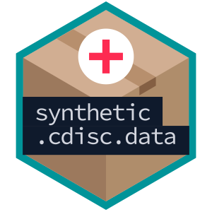

# Scda: Synthetic CDISC Data Archive Accessor Functions <a href='https://insightsengineering.github.io/scda'></a>

This R package contains functions for accessing synthetic CDISC from data archive packages such as [scda.2022](https://insightsengineering.github.io/scda.2022).
At least one of these archive packages should be installed in order to use this package.

This synthetic data can be used as test data when developing `teal` applications or statistical analysis functions and due to the data not been derived from a real clinical trial it provides an excellent method for generating reproducible examples when reporting errors.

Note however that this data is somewhat idealized and real trial data is often significantly more complex and messy.

## Installation

It is recommended that you [create and use a Github PAT](https://docs.github.com/en/github/authenticating-to-github/keeping-your-account-and-data-secure/creating-a-personal-access-token) to install the latest version of this package. Once you have the PAT, run the following:

```r
Sys.setenv(GITHUB_PAT = "your_access_token_here")
if (!require("devtools")) install.packages("devtools")
devtools::install_github("insightsengineering/scda@*release")
```

It is necessary to manually install at least one data archive package (e.g. [scda.2022](https://insightsengineering.github.io/scda.2022)) before using this package.

## Basic Usage

You can see which data are available with

```r
library(scda)
ls_synthetic_cdisc_data()
```

And to load a specific data archive use

```r
# chose the first one
chosen_data_archive <- ls_synthetic_cdisc_data()$Name[1]
print(chosen_data_archive)
oldest_dfs <- synthetic_cdisc_data(chosen_data_archive)
names(oldest_dfs)

# chose the latest one
latest_dfs <- synthetic_cdisc_data("latest")
names(latest_dfs)
```
